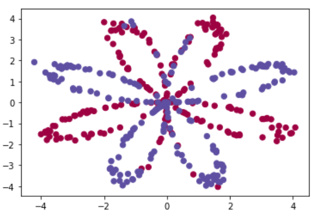
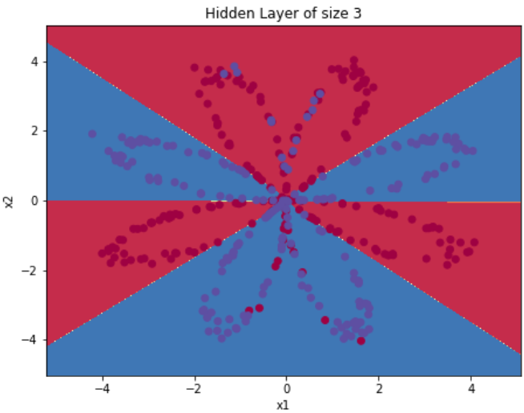

# Deep Learning [[Certificate]](https://coursera.org/share/6b2c36d247f4969bc3c94c296484c96f)
A collection of my study notes and projects in the course [**Deep Learning** (taught by Andrew Ng)](https://www.coursera.org/specializations/deep-learning).

## X-mind:
[Course 1 - Neural Network & Deep Learning](https://github.com/Sonia-96/Deep_Learning/blob/master/Course1-Neural%20Networks%20%26%20Deep%20Learning/1-Neural%20Network%20%26%20Deep%20Learning.xmind)

[Course 2 - Improve Deep Neural Network](https://github.com/Sonia-96/Deep_Learning/blob/master/Course2-Improve%20Deep%20NN/2-Improve%20Deep%20NN.xmind)

[Course 3 - Structuring Machine Learning Projects](https://github.com/Sonia-96/Deep_Learning/blob/master/Course3-Structuring%20Machine%20Learning%20Projects/3-ML%20Strategy.xmind)

[Course 4 - Convolutional Neural Networks](https://github.com/Sonia-96/Deep_Learning/blob/master/Course4-Convolutional%20Neural%20Networks/4-CNN.xmind)

[Course 5 - Sequence Models](https://github.com/Sonia-96/Deep_Learning/blob/master/Course5-Recurrent%20Neural%20Networks/5-RNN.xmind)

## Study Notes:

1. [Logistic regression in Python](https://github.com/Sonia-96/Deep_Learning/blob/master/Course1-Neural%20Networks%20%26%20Deep%20Learning/Week2%20-%20Logistic%20Regression/Logistic%20Regression%20Classifier%20Recognizing%20Cats.ipynb)

2. [Build a deep neural network](https://github.com/Sonia-96/Deep_Learning/blob/master/Course1-Neural%20Networks%20%26%20Deep%20Learning/Week4%20-%20Deep%20Neural%20Network/Build%20a%20Deep%20Neural%20Network.ipynb)

3. [Initialization, regularization, gradient checking](https://github.com/Sonia-96/Deep_Learning/tree/master/Course2-Improve%20Deep%20NN/Week1%20-%20Practical%20Aspects%20of%20DL)

4. [Optimization methods: mini-batch GD, Momentum, Adam](https://github.com/Sonia-96/Deep_Learning/blob/master/Course2-Improve%20Deep%20NN/Week2%20-%20Optimization%20Algorithms/Optimization%20Methods.ipynb)

5. [TensorFlow tutorial](https://github.com/Sonia-96/Deep_Learning/blob/master/Course2-Improve%20Deep%20NN/Week3%20-%20Tensorflow%20Tutorial/A%20Classifier%20Recognizing%20Numbers%20in%20Sign%20(%2B%20TensorFlow%20Tutorial).ipynb)

6. [Build a Convolutional Neural Network](https://github.com/Sonia-96/Deep_Learning/blob/master/Course4-Convolutional%20Neural%20Networks/Week1%20-%20Convalutional%20Neural%20Networks/Convolutional%20Neural%20Networks.ipynb)

7. [Keras tutorial](https://github.com/Sonia-96/Deep_Learning/blob/master/Course4-Convolutional%20Neural%20Networks/Week2%20-%20Deep%20Convolutional%20Models/Keras%20Tutorial/A%20Classifier%20Recognizing%20Smiling%20Faces%20(%2B%20Keras%20Tutorial).ipynb)

8. [Build a Recurrent Neural Network](https://github.com/Sonia-96/Deep_Learning/tree/master/Course5-Recurrent%20Neural%20Networks/Week1-RNN/Building%20a%20RNN)

9. [Word embeddings and debiasing](https://github.com/Sonia-96/Deep_Learning/blob/master/Course5-Recurrent%20Neural%20Networks/Week2-Word%20Embeddings/Operations%20on%20Word%20Vectors/Operations%20on%20Word%20Vectors.ipynb)

## Projects
#### 1. [Planar data classification with one didden layer](https://github.com/Sonia-96/Deep_Learning/blob/master/Course1-Neural%20Networks%20%26%20Deep%20Learning/Week3%20-%20Planar%20Data%20Classification%20with%20One%20Hidden%20Layer/Planar%20Data%20Classification%20with%20One%20Hidden%20Layer.ipynb)
  
  Implement a binary classification neural network with one hidden layer. This model can classify red points and blue points in the same image with accuracy more than 90%.

<table>
<td> 
  
</td> 
<td> 
  
</td> 
</table>

#### 2. [A deep neural network classifying cats](https://github.com/Sonia-96/Deep_Learning/blob/master/Course1-Neural%20Networks%20%26%20Deep%20Learning/Week4%20-%20Deep%20Neural%20Network/A%20Deep%20Neural%20Network%20Classifying%20Cats.ipynb)
  
Build a deep neural network to classifie **cats vs. non-cats** images with accuracy more than 80%.

#### 3. [A Classifier recognizing smiling faces]()

Implement a classifier in Keras. This model can recognize people's faces and classify them as "happy" or "not happy" with accuracy more than 90%.

#### 4. [A ResNet recognizing numbers in sign](https://github.com/Sonia-96/Deep_Learning/blob/master/Course4-Convolutional%20Neural%20Networks/Week2%20-%20Deep%20Convolutional%20Models/ResNets/A%20ResNet%20Recognizing%20Numbers%20in%20Sign.ipynb)

Implement a ResNet in Keras for a classification problem. This model can recognize signs representing numbers from 0 to 5 with accuracy more than 85%.

#### 5. [Car detection with YOLO algorithm](https://github.com/Sonia-96/Deep_Learning/blob/master/Course4-Convolutional%20Neural%20Networks/Week3%20-%20Object%20Detection/Car%20Detection%20with%20YOLO%20Algorithm.ipynb)

Use YOLO model to detect cars and their positions in images.

#### 6. [Neural style transfer](https://github.com/Sonia-96/Deep_Learning/blob/master/Course4-Convolutional%20Neural%20Networks/Week4%20-%20Face%20Recognization%20%26%20Neural%20Style%20Transfer/Neural%20Style%20Transfer.ipynb)

Implement the Neural Style Transfer algorithm and generate novel artistic images using this algorithm.

#### 7. [Face recognition](https://github.com/Sonia-96/Deep_Learning/blob/master/Course4-Convolutional%20Neural%20Networks/Week4%20-%20Face%20Recognization%20%26%20Neural%20Style%20Transfer/Face%20Recognition.ipynb)

Build a face recognition system to identify a person.

#### 8. [Character level language model - Dinosaurus island](https://github.com/Sonia-96/Deep_Learning/blob/master/Course5-Recurrent%20Neural%20Networks/Week1-RNN/Dinosaurus%20Island/Character%20level%20language%20model%20-%20Dinosaurus%20Island.ipynb)

Implement a character level language model which can give names to dinosaurs with cool endings like 'saurus', 'don' etc.

#### 9. [Improvise a jazz solo with an LSTM network](http://localhost:8888/notebooks/Downloads/Deep%20Learning/Course5/Week1-RNN/Jazz%20Improvisation%20with%20an%20LSTM/Improvise%20a%20Jazz%20Solo%20with%20an%20LSTM%20Network.ipynb)

Implement a model that uses an LSTM to generate music.

#### 10. [Emojify](https://github.com/Sonia-96/Deep_Learning/blob/master/Course5-Recurrent%20Neural%20Networks/Week2-Word%20Embeddings/Emojify/Emojify.ipynb)

Build an emojifier which can add the most appropriate emoji to the end of a sentence. For example:

- Input sentence: Congratulations on the promotion!
- Output sentence: Congratulations on the promotion! 👍

#### 11. [Neural machine translation on dates](https://github.com/Sonia-96/Deep_Learning/blob/master/Course5-Recurrent%20Neural%20Networks/Week3-Sequence%20Models/Attention%20Model/Neural%20Machine%20Translation%20on%20Dates.ipynb)

Use an attention model to translate human-readable dates ("25th of June, 2009") into machine-readable dates ("2009-6-25").

#### 12. [Trigger word detection](https://github.com/Sonia-96/Deep_Learning/blob/master/Course5-Recurrent%20Neural%20Networks/Week3-Sequence%20Models/Trigger%20Word%20Detection/Trigger%20Word%20Detection.ipynb)

Trigger word detection is the technology that allows devices like Amazon Alexa, Google Home, Apple Siri, and Baidu DuerOS to wake up upon hearing a certain word. For this project, our trigger word will be "Activate". Every time it hears you say "activate", it will make a "chiming" sound.

